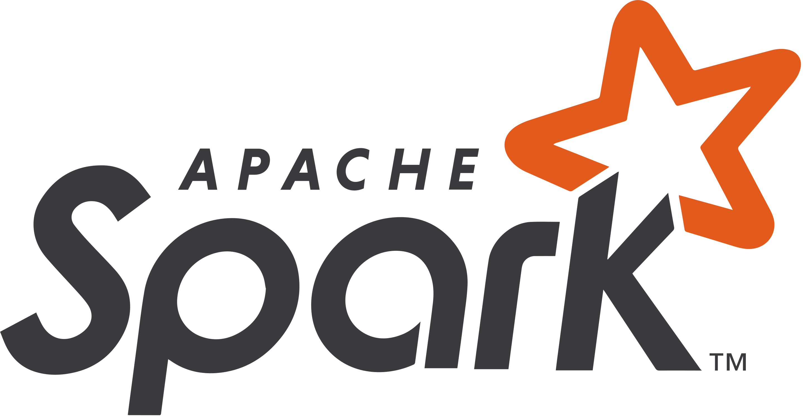

# Data Engineering

<table style="width:100%">
  <tr>
    <td></td>
    <td></td>
    <td></td>
    <td></td>
    <td></td>
    <td></td>
    <td></td>
  </tr>
</table>

> :warning: The contents of this repo are **living documents**. While to repo name will stay the same, the organization of the contents may change. And of course, new stuff is constantly being added.

 

This repo is a sort of **digital garden on data engineering**. Each topic is meant to be self-contained and is organized into folders.

* `data-manipulation` - A common task (not just for data engineers) is how to manipulate data. This involves selecting, filtering, and aggregating data. For completeness and comparability I've included various languages and packages within those languages.
* `design-patterns` - (_coming soon!_) A collection of design patterns that I've picked up over the years.
* `platforms` - (_coming soon!_) A big part of data engineering is knowing what platforms to use (e.g. Postgres, Spark, S3, etc). There's a lot out there and it's crucial to make sure the right platform is being chosen for the task at hand. Here I discuss those platforms, including simple data stores, data warehouses, and scheduling/orchestration tools.
* `mapreduce` - A data aggregation design pattern that deserves a section of it's own. It set the foundation for big data computations across multiple machines.
* `razors` - (_coming soon!_) Some useful principles that I've codified to make my workflow better.
* `resources` - (_coming soon!_) A lot of what I talk about isn't anything new. I'm building off of great work done by others. I list those here.